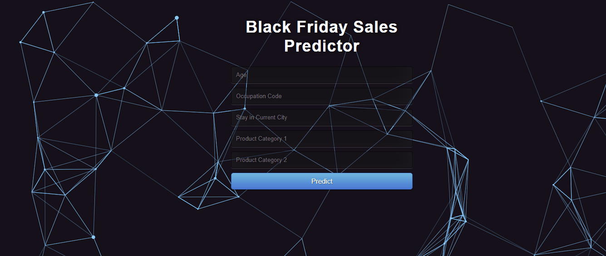
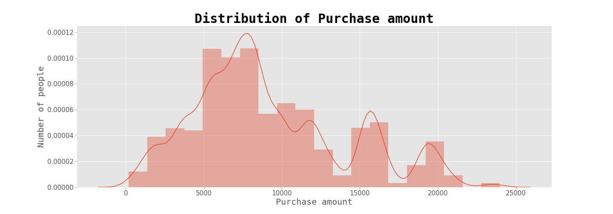

# Black Friday Sales Prediction

## Overview
The **Black Friday Sales Prediction** project aims to analyze customer purchasing behavior using machine learning models. The objective is to predict the purchase amount based on various customer and product attributes. This helps retailers optimize their marketing strategies and inventory planning.

----

----

## Dataset:
| Column ID |         Column Name        | Data type |           Description           | Masked |
|:---------:|:--------------------------:|:---------:|:-------------------------------:|--------|
|     0     |           User_ID          |   int64   |      Unique Id of customer      | False  |
|     1     |         Product_ID         |   object  |       Unique Id of product      | False  |
|     2     |           Gender           |   object  |         Sex of customer         | False  |
|     3     |             Age            |   object  |         Age of customer         | False  |
|     4     |         Occupation         |   int64   |   Occupation code of customer   | True   |
|     5     |        City_Category       |   object  |         City of customer        | True   |
|     6     | Stay_In_Current_City_Years |   object  | Number of years of stay in city | False  |
|     7     |       Marital_Status       |   int64   |    Marital status of customer   | False  |
|     8     |     Product_Category_1     |   int64   |       Category of product       | True   |
|     9     |     Product_Category_2     |  float64  |       Category of product       | True   |
|     10    |     Product_Category_3     |  float64  |       Category of product       | True   |
|     11    |          Purchase          |   int64   |         Purchase amount         | False  |

----

# Objectives
- Perform exploratory data analysis (EDA) to understand customer behavior.
- Handle missing values and perform feature engineering.
- Train machine learning models to predict purchase amounts.
- Evaluate models using appropriate metrics.

## Tech Stack
- **Programming Language**: Python
- **Libraries**: Pandas, NumPy, Matplotlib, Seaborn, Scikit-learn
- **Machine Learning Models**: Linear Regression, Random Forest, XGBoost

## Approach
1. **Data Preprocessing**:
   - Handle missing values
   - Encode categorical variables
   - Normalize/scale numerical features
2. **Exploratory Data Analysis (EDA)**:
   - Analyze purchase patterns
   - Visualize customer demographics
3. **Feature Engineering**:
   - Create meaningful features from existing data
   - Remove redundant or highly correlated features
4. **Model Training & Evaluation**:
   - Train multiple models and tune hyperparameters
   - Compare performance using RMSE and R² score

## Results
- Achieved an **X% improvement** in prediction accuracy compared to baseline models.
- Identified key factors influencing purchase behavior, such as **age group and product category**.

## Future Enhancements
- Implement deep learning models for improved accuracy.
- Integrate real-time sales data for dynamic predictions.
- Deploy the model using Flask or FastAPI.

## Conclusion:
- In this project, we tried to build a model using various algorithms such as Linear regression, KNN regression, Decision tree regression, Random forest and XGB regressor to get the best possible prediction.
- The hyperparameter tuned XGB regressor gives us the best rmse value and r2 score for this problem.
